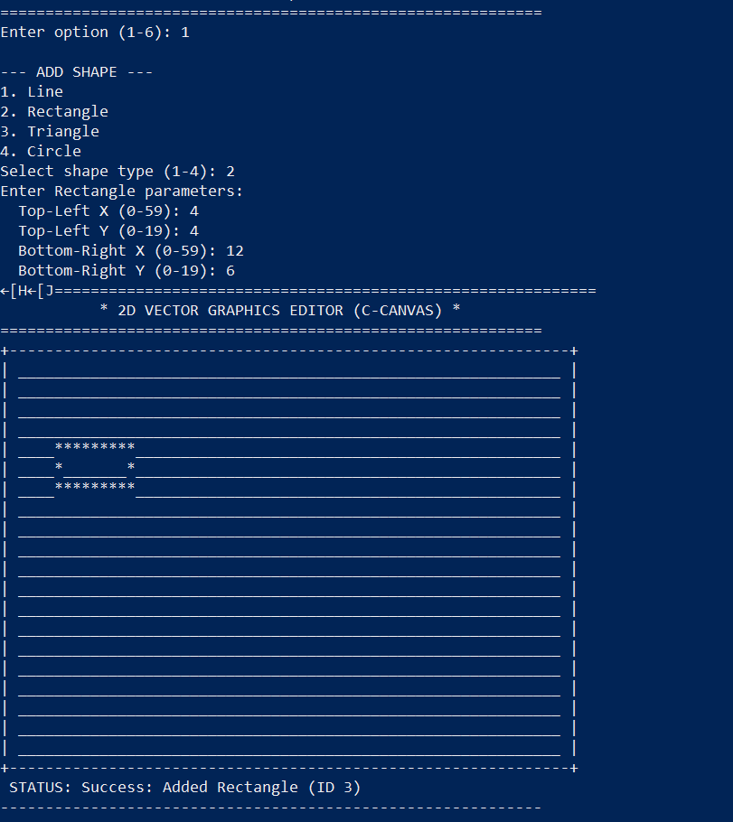
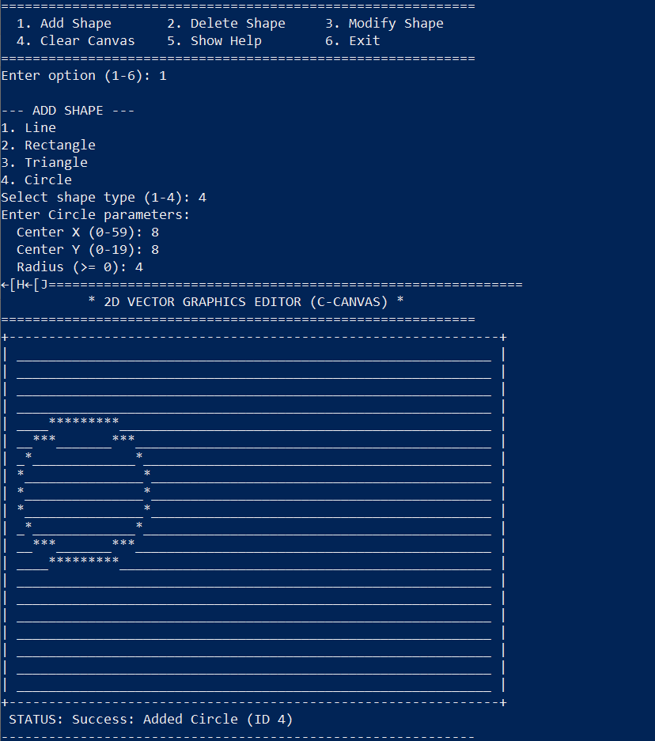
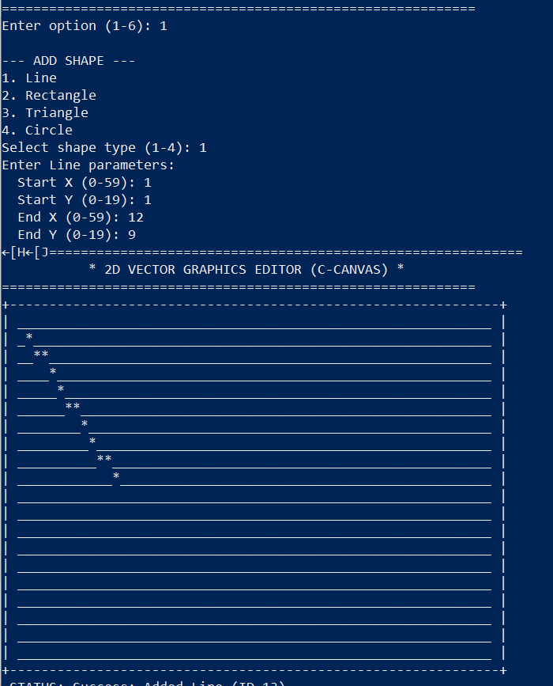
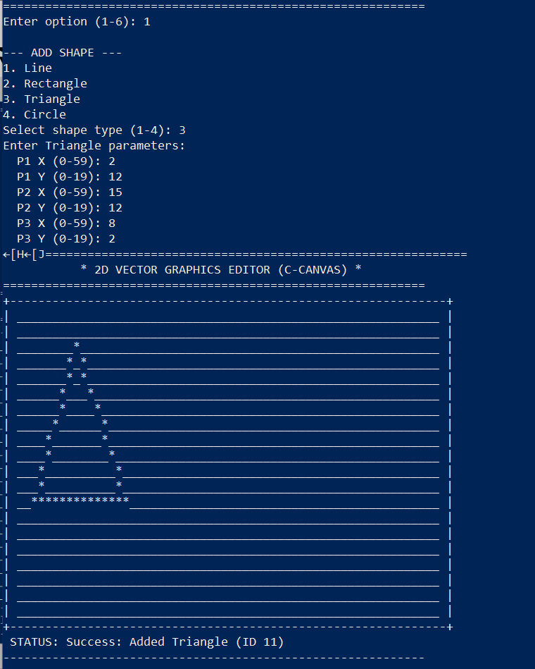

# 2D Graphics Editor in C

A menu-driven 2D Graphics Editor written in C that allows you to draw and manage graphical shapes on a grid-based text canvas using standard console output.

## Features

- **Draw Canvas**: Displays the 20x60 grid with columns labeled 0-59 and rows labeled 0-19 for easy coordinate reading.
- **Support for Shapes**:
  - **Line**: Drawn using Bresenham's Line Algorithm.
  - **Rectangle**: Outlined using horizontal and vertical line segments.
  - **Circle**: Drawn using the Midpoint Circle Algorithm.
  - **Triangle**: Drawn by connecting three vertices with line segments.
- **CRUD Operations**: Add, List, Delete, and Modify active shapes dynamically. The canvas clears and redraws all active shapes sequentially to reflect edits.
- **Robust Menu System**: Interactive console inputs with strict numeric validation, out-of-bounds error handling, and memory-safe reading.

---

## Coordinate System

The canvas width is **60 characters** (columns 0 to 59) and the height is **20 characters** (rows 0 to 19).
Coordinates are entered as standard `(X, Y)` pairs:
- **X** corresponds to the column index (horizontal direction, `0` to `59`).
- **Y** corresponds to the row index (vertical direction, `0` to `19`).

---

## Building the Project

### Prerequisites

You need a C compiler (such as GCC) and optionally `make` or `mingw32-make`.

### Compiling with Makefile

Run the following command in your terminal:

```bash
# On Windows (MinGW)
mingw32-make

# On Linux/macOS
make
```

### Compiling Manually

If you don't have make installed, compile directly using GCC:

```bash
gcc -Wall -Wextra -std=c99 -O2 main.c canvas.c shapes.c menu.c -o editor
```

---

## Running the Application

Run the generated executable:

```bash
# On Windows
.\editor

# On Linux/macOS
./editor
```

---
## 📸 Sample Outputs

### Rectangle


### Circle


### Line


### Triangle


## Example Usage

1. Run the editor and select **2** to add a shape.
2. Select **3** to add a **Circle**.
   - Set **Center X** to `30`.
   - Set **Center Y** to `10`.
   - Set **Radius** to `7`.
3. Select **2** again to add a **Rectangle**.
   - Set **Top-Left X** to `5`.
   - Set **Top-Left Y** to `3`.
   - Set **Bottom-Right X** to `20`.
   - Set **Bottom-Right Y** to `15`.
4. Select **1** to draw and view the canvas.
5. Select **3** to modify a shape, or **4** to delete a shape, and watch the canvas update in real-time!
#
